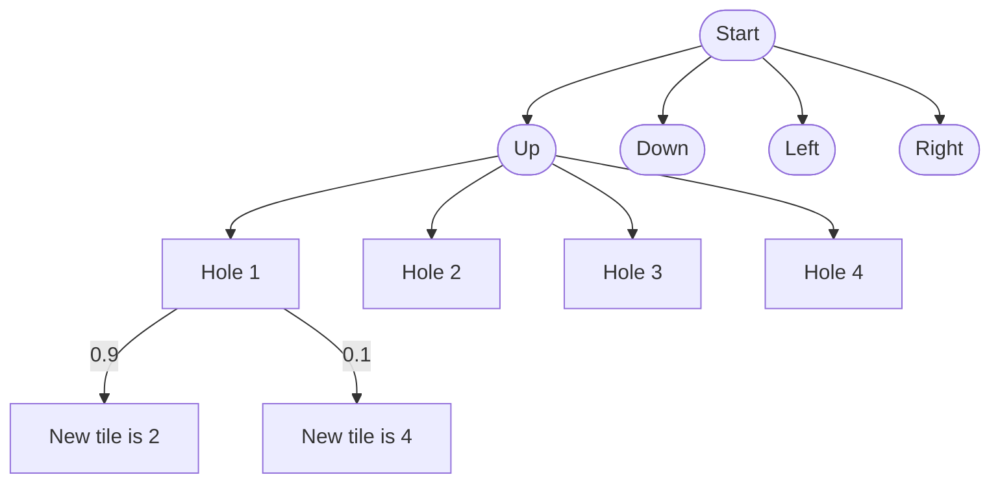

# Määrittelydokumentti

Koulutusohjelma: tietojenkäsittelytieteen kandidaatti (TKT)
Dokumentaatiossa käytetty kieli: suomi

Työksi valikoitui 2048 peli, jota pelataan algoritmilla.

## Kielivalinta

Käytettävä ohjelmointikieli on Rust. Hallitsen myös Pythonia, Java/TypeScriptiä, Scalaa ja hieman GO:ta.

## Algoritmit ja tietorakenteet

Valittu algoritmi on [expectiminimax](https://en.wikipedia.org/wiki/Expectiminimax) muunnettuna yhtä pelaajaa varten. Algoritmi on siis muunneltu versio [minimax](https://en.wikipedia.org/wiki/Minimax) algoritmista. Algoritmi käy läpi kaikki mahdolliset siirrot ja valitsee niistä parhaan. Lähtökohtaisesti paras pelitila on se, missä on suurin luku. Muitakin heuristisia funktiota on mahdollista tutkia.

Algoritmia muunnellaan niin, että siinä on vain maksimoija- ja satunnaisnodet. Minimointi-nodeja ei tarvita, koska peliä pelaa vain yksi pelaaja.

Satunnaisodeja on kahdessa kohtaa peliä: mihin kohtaan uusi ruutu tulee ja onko se 4 vai 2. Uusien ruutujen mahdollisia paikkoja on siis muuttuva määrä riippuen pelin tilasta. Uuden ruudun paikka valitaan satunnaisesti, mutta todennäköisyydet ovat eri suuret eri paikoissa. Uuden ruudun arvo valitaan myös satunnaisesti, mutta todennäköisyydet ovat 0.9 numerolle kaksi ja 0.1 numerolle neljä. Illuustraatio algoritmin toiminnasta:

## Ongelma

Toteutetaan 2048 peli, jota algoritmi pelaa. Tavoitteena on saada mahdollisimman suuri luku. Expectiminimax valikoitui algortimiksi, koska se soveltuu pelien pelaamiseen ja se ottaa huomioon pelin satunnaisuuden, mikä on tärkeää 2048 pelissä.

## Syötteet

Ohjelma saa syötteekseen seedin, jolla peli alustetaan. Seedin avulla peli kulkee aina samalla tavalla, jolloin algoritmin toimintaa on helpompi seurata. Seedin avulla peli voidaan myös toistaa, jolloin voidaan verrata eri algoritmeja keskenään. Jos seediä ei anneta, käytetään satunnaista seediä. Seedinä käytetään 64-bittistä kokonaislukua. Seedin voi antaa komentoriviltä tai se voidaan kysyä käyttäjältä.

Toinen parametri jonka ohjelma saa on todennäköisyys sille, että uusi ruutu on 4. Todennäköisyys on 0.1, jos parametria ei anneta.

Jos aikaa riittää, olisi myös mahdollista implementoida peliruudukon koko yhdeksi parametriksi.

## Aika- ja tilavaativuudet

Aikavaativuus on O((4*2*b)^d) eli käytännössä O(b^d) missä b on keskimääräinen tyhjien ruutujen määrä ja d on pelipuun syvyys. Keskimääräinen tyhjien ruutujen määrä riippuu pelin tilasta ja pelipuun syvyys riippuu siitä kuinka paljon laskennallista tehoa on käytettävissä. Tilavaativuus on O(b^d).

## Lähteet

Zaky, A. (2022). Minimax and expectimax algorithm to solve 2048

Melkó, E., & Nagy, B. (2007). Optimal strategy in games with chance nodes. Acta Cybernetica, 18(2), 171-192.

